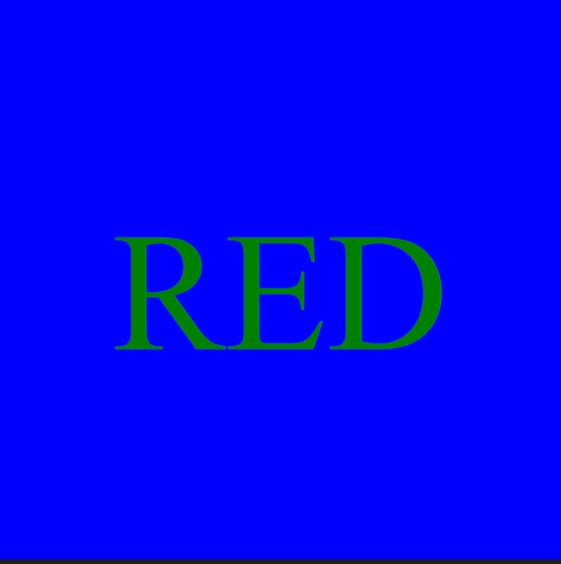

# SVG Logo Maker

## Description
The application enables users to enter colour and text inputs in the command line using node js, to create a "logo.svg" file which reflects the user's desired results.

## Installation
Initiate the prompt questions using node index.js, initiate the testing using npm test.

## Built With
- JavaScript
- Node.js
- Jest
- Inquirer.js
- Visual Studio Code

## Usage
Video link here which walks through the svg file generation and testing: https://drive.google.com/file/d/1fUwR3_YNb5hqgCt-nvee-EcArJW2aFlS/view?usp=drive_link

Example image previously rendered here:

## License
MIT License
